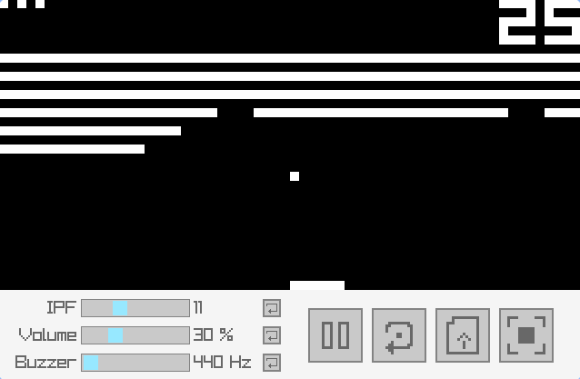

# CHIP-8 Go
A simple CHIP-8 interpreter written in Golang.

## Compiling
To compile the program, run the following command:
```bash
make
```

This will output the program on `build/chip8go`. If you want to clean the build directory run the following command:
```bash
make clean
```

## Usage
### Input
The program is controlled through a 4x4 hexadecimal keypad:
```
1 2 3 C         1 2 3 4
4 5 6 D   ==>   Q W E R
7 8 9 E         A S D F
A 0 B F         Z X C V
```
On the left are the original **COSMAC VIP** keys and on the right the equivalent on your keyboard. This layout is meant for a **QWERTY** keyboard only.

### GUI


The GUI can be enabled or disabled using the *Space* key.
It has 3 sliders that allow control of:

- The amount of instructions per frame.
- The volume percentage.
- The tone of the buzzer (frequency).

It also has 4 buttons that allow:

- Pausing the emulator
- Resetting the emulator
- Loading another ROM from a file
- Resetting the window size

The window can be resized (it will not keep its aspect ratio).
